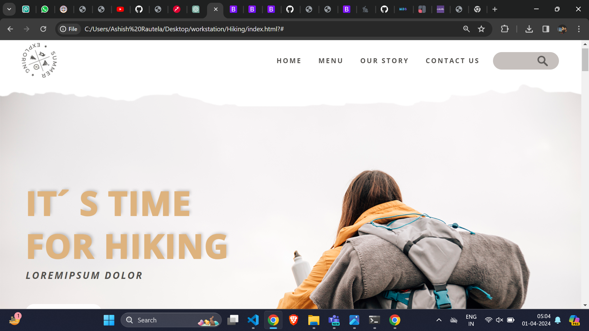
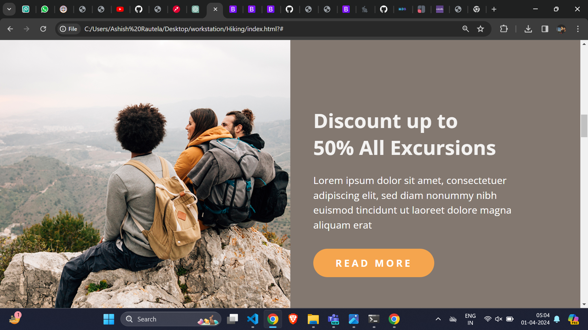
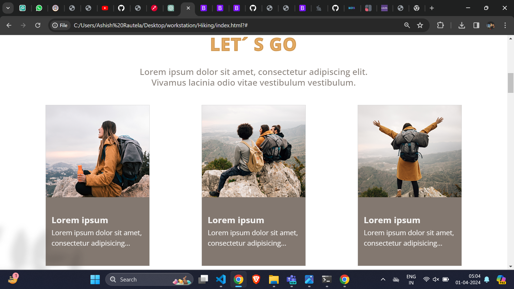
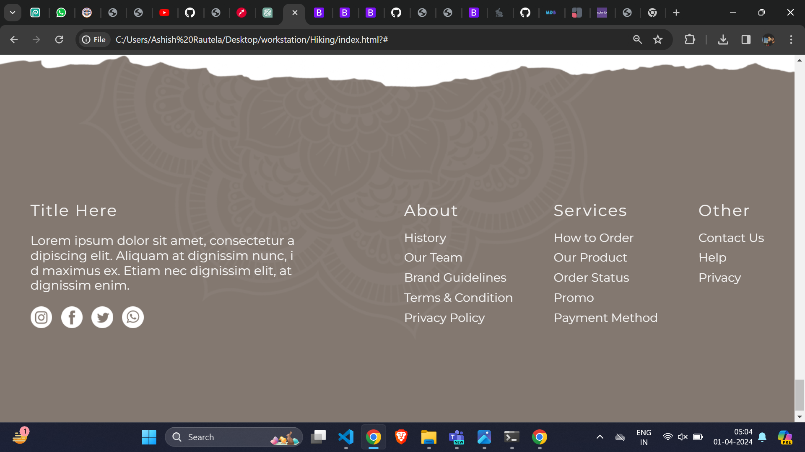

# Hiking Project

## Overview

The Hiking project is a comprehensive web application that aims to provide users with an immersive experience in exploring hiking destinations, discovering offers and promotions, reading testimonials, and subscribing for updates. It is designed with a user-friendly interface and responsive design to ensure compatibility across various devices.

## Technologies Used

The project utilizes the following technologies:

- **HTML5**: For structuring the content of web pages.
- **CSS3**: For styling and layout design.
- **Bootstrap 5**: For responsive design, pre-built components, and utility classes.
- **JavaScript (Bootstrap JavaScript plugins)**: For interactive elements and enhanced user experience.

## Features

1. **Responsive Design**: Ensures optimal viewing experience across devices.
2. **Navigation Bar**: Allows easy navigation between different sections of the website.
3. **Landing Page**: Engaging introduction to the project with attractive visuals and content.
4. **Places Section**: Highlights various hiking destinations with detailed descriptions and images.
5. **Offers Section**: Showcases discounts, promotions, and special offers to attract users.
6. **Testimonials**: Provides real customer testimonials to build trust and credibility.
7. **Subscription Form**: Allows users to subscribe for updates, newsletters, and exclusive offers.
8. **Footer**: Includes essential links, social media integration, and contact information.

## Screenshots







## Setup Instructions

1. **Clone the Repository**:
   ```bash
   git clone https://github.com/ashishrautela612/Summer-Exploring

2. Clone the repository to your local machine.
3. Open the project folder in your code editor.
4. Modify the content in HTML and CSS files as needed.
5. Customize images, logos, and other assets in the 'public' folder.
6. Run the website locally to test responsiveness and functionality. 
